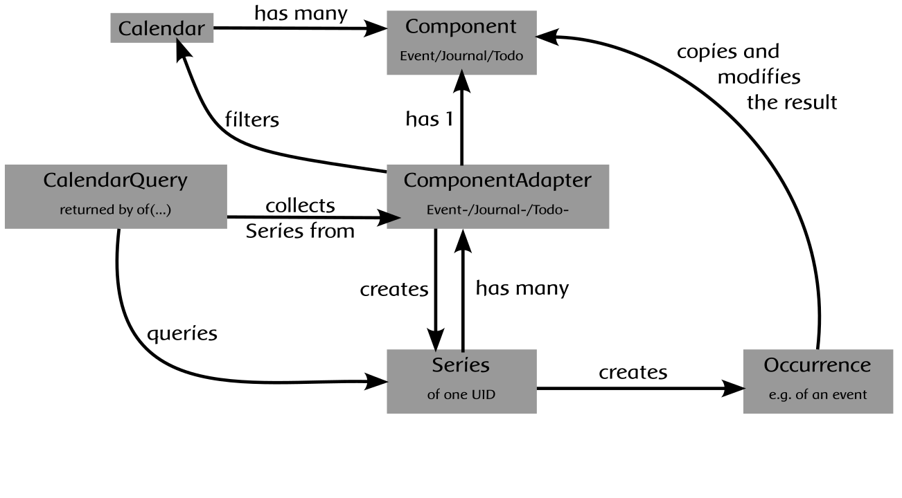

Recurring ICal events for Python
================================

.. image:: https://github.com/niccokunzmann/python-recurring-ical-events/actions/workflows/tests.yml/badge.svg
   :target: https://github.com/niccokunzmann/python-recurring-ical-events/actions/workflows/tests.yml
   :alt: GitHub CI build and test status
.. image:: https://badge.fury.io/py/recurring-ical-events.svg
   :target: https://pypi.python.org/pypi/recurring-ical-events
   :alt: Python Package Version on Pypi
.. image:: https://img.shields.io/pypi/dm/recurring-ical-events.svg
   :target: https://pypi.org/project/recurring-ical-events/#files
   :alt: Downloads from Pypi
.. image:: https://img.shields.io/opencollective/all/open-web-calendar?label=support%20on%20open%20collective
   :target: https://opencollective.com/open-web-calendar/
   :alt: Support on Open Collective
.. image:: https://img.shields.io/github/issues/niccokunzmann/python-recurring-ical-events?logo=github&label=issues%20seek%20funding&color=%230062ff
   :target: https://polar.sh/niccokunzmann/python-recurring-ical-events
   :alt: issues seek funding

ICal has some complexity to it:
Events, TODOs and Journal entries can be repeated, removed from the feed and edited later on.
This tool takes care of these circumstances.

Let's put our expertise together and build a tool that can solve this!

.. image:: https://img.shields.io/badge/RFC_2445-deprecated-red
   :target: https://datatracker.ietf.org/doc/html/rfc2445#section-4.8.5.2
   :alt: RFC 2445 is deprecated
.. image:: https://img.shields.io/badge/RFC_5545-supported-green
   :target: https://datatracker.ietf.org/doc/html/rfc5545
   :alt: RFC 5545 is supported
.. image:: https://img.shields.io/badge/RFC_7529-todo-red
   :target: https://github.com/niccokunzmann/python-recurring-ical-events/issues/142
   :alt: RFC 7529 is not implemented
.. image:: https://img.shields.io/badge/RFC_7953-todo-red
   :target: https://github.com/niccokunzmann/python-recurring-ical-events/issues/143
   :alt: RFC 7953 is not implemented

* day light saving time (DONE)
* recurring events (DONE)
* recurring events with edits (DONE)
* recurring events where events are omitted (DONE)
* recurring events events where the edit took place later (DONE)
* normal events (DONE)
* recurrence of dates but not hours, minutes, and smaller (DONE)
* endless recurrence (DONE)
* ending recurrence (DONE)
* events with start date and no end date (DONE)
* events with start as date and start as datetime (DONE)
* `RRULE <https://www.kanzaki.com/docs/ical/rrule.html>`_ (DONE)
* events with multiple RRULE (DONE)
* `RDATE <https://www.kanzaki.com/docs/ical/rdate.html>`_ (DONE)
* `DURATION <https://www.kanzaki.com/docs/ical/duration.html>`_ (DONE)
* `EXDATE <https://www.kanzaki.com/docs/ical/exdate.html>`_ (DONE)
* `X-WR-TIMEZONE` compatibilty (DONE)
* non-gregorian event repetitions (TODO)
* RECURRENCE-ID with THISANDFUTURE - modify all future events (DONE)

Not included:

* EXRULE (deprecated), see `8.3.2.  Properties Registry
  <https://tools.ietf.org/html/rfc5545#section-8.3.2>`_

Installation
------------

You can install this package using ``pip``.

.. code:: shell

    pip install 'recurring-ical-events==3.*'

On Debian/Ubuntu, you use the package manager to install `python-recurring-ical-events <https://tracker.debian.org/pkg/python-recurring-ical-events>`_.

.. code:: shell

    sudo apt-get install python-recurring-ical-events

If you would like to use this functionality on the command line or in the shell, you can use
`ics-query <https://github.com/niccokunzmann/ics-query#readme>`_.

Support
-------

- `Support using GitHub Sponsors <https://github.com/sponsors/niccokunzmann>`_
- `Fund specific issues using Polar <https://polar.sh/niccokunzmann/python-recurring-ical-events>`_
- `Support using Open Collective <https://opencollective.com/open-web-calendar/>`_
- `Support using thanks.dev <https://thanks.dev>`_

We accept donations to sustain our work, once or regular.
Consider donating money to open-source as everyone benefits.

Usage
-----

The `icalendar <https://pypi.org/project/icalendar/>`_ module is responsible for parsing and converting calendars.
The `recurring_ical_events <https://pypi.org/project/recurring-ical-events/>`_ module uses such a `calendar`_ and creates all repetitions of its events within a time span.

To import this module, write

.. code:: Python

    >>> import recurring_ical_events

There are several methods you can use to unfold repeating events, such as ``at(a_time)`` and ``between(a_start, an_end)``.

Example
-------

.. code-block:: python

    >>> import icalendar
    >>> import recurring_ical_events
    >>> from pathlib import Path

    # read the calendar file and parse it
    # CALENDARS = Path("to/your/calendar/directory")
    >>> calendar_file : Path = CALENDARS / "fablab_cottbus.ics"
    >>> ical_string = calendar_file.read_bytes()
    >>> print(ical_string[:28])
    BEGIN:VCALENDAR
    VERSION:2.0
    >>> a_calendar = icalendar.Calendar.from_ical(ical_string)

    # request the events in a specific interval
    # start on the 1st of January 2017 0:00
    >>> start_date = (2017, 1, 1)

    # the event on the 1st of January 2018 is not included
    >>> end_date =   (2018,  1, 1)
    >>> events = recurring_ical_events.of(a_calendar).between(start_date, end_date)
    >>> for event in events:
    ...     start = event["DTSTART"].dt
    ...     summary = event["SUMMARY"]
    ...     print(f"start {start} summary {summary}")
    start 2017-03-11 17:00:00+01:00 summary Vereinssitzung
    start 2017-06-10 10:00:00+02:00 summary Repair und Recycling Café
    start 2017-06-11 16:30:00+02:00 summary Brandenburger Maker-Treffen
    start 2017-07-05 17:45:00+02:00 summary Der Computer-Treff fällt aus
    start 2017-07-29 14:00:00+02:00 summary Sommerfest
    start 2017-10-19 16:00:00+02:00 summary 3D-Modelle programmieren mit OpenSCAD
    start 2017-10-20 16:00:00+02:00 summary Programmier dir deine eigene Crypto-Währung
    start 2017-10-21 13:00:00+02:00 summary Programmiere deine eigene Wetterstation
    start 2017-10-22 13:00:00+02:00 summary Luftqualität: Ein Workshop zum selber messen (Einsteiger)
    start 2017-10-22 13:00:00+02:00 summary Websites selbst programmieren

``at(a_date)``
**************

You can get all events which take place at ``a_date``.
A date can be a year, e.g. ``2023``, a month of a year e.g. January in 2023 ``(2023, 1)``, a day of a certain month e.g. ``(2023, 1, 1)``, an hour e.g. ``(2023, 1, 1, 0)``, a minute e.g. ``(2023, 1, 1, 0, 0)``, or second as well as a `datetime.date <https://docs.python.org/3/library/datetime.html#datetime.date>`_ object and `datetime.datetime <https://docs.python.org/3/library/datetime.html#datetime.datetime>`_.

The start and end are inclusive. As an example: if an event is longer than one day it is still included if it takes place at ``a_date``.

.. code:: Python

    >>> import datetime

    # save the query object for the calendar
    >>> query = recurring_ical_events.of(a_calendar)
    >>> len(query.at(2023))                      # a year - 2023 has 12 events happening
    12
    >>> len(query.at((2023,)))                   # a year
    12
    >>> len(query.at((2023, 1)))                 # January in 2023 - only one event is in January
    1
    >>> len(query.at((2023, 1, 1)))              # the 1st of January in 2023
    0
    >>> len(query.at("20230101"))                # the 1st of January in 2023
    0
    >>> len(query.at((2023, 1, 1, 0)))           # the first hour of the year 2023
    0
    >>> len(query.at((2023, 1, 1, 0, 0)))        # the first minute in 2023
    0
    >>> len(query.at(datetime.date(2023, 1, 1))) # the first day in 2023
    0
    >>> len(query.at(datetime.date.today()))     # today
    0
    >>> len(query.at(datetime.datetime.now()))   # this exact second
    0

The resulting ``events`` are a list of `icalendar events <https://icalendar.readthedocs.io/en/latest/api.html#icalendar.cal.Event>`_, see below.

``between(start, end)``
***********************

``between(start, end)`` returns all events happening between a start and an end time. Both arguments can be `datetime.datetime`_, `datetime.date`_, tuples of numbers passed as arguments to `datetime.datetime`_ or strings in the form of
``%Y%m%d`` (``yyyymmdd``) and ``%Y%m%dT%H%M%SZ`` (``yyyymmddThhmmssZ``).
Additionally, the ``end`` argument can be a ``datetime.timedelta`` to express that the end is relative to the ``start``.
For examples of arguments, see ``at(a_date)`` above.

.. code:: Python

    >>> query = recurring_ical_events.of(a_calendar)

    # What happens in 2016, 2017 and 2018?
    >>> events = recurring_ical_events.of(a_calendar).between(2016, 2019)
    >>> len(events) # quite a lot is happening!
    39

The resulting ``events`` are in a list of `icalendar events`_, see below.

``after(earliest_end)``
***********************

You can retrieve events that happen after a time or date using ``after(earliest_end)``.
Events that are happening during the ``earliest_end`` are included in the iteration.

.. code:: Python

    >>> earlierst_end = 2023
    >>> for i, event in enumerate(query.after(earlierst_end)):
    ...     print(f"{event['SUMMARY']} ends {event['DTEND'].dt}") # all dates printed are after January 1st 2023
    ...     if i > 10: break  # we might get endless events and a lot of them!
    Repair Café ends 2023-01-07 17:00:00+01:00
    Repair Café ends 2023-02-04 17:00:00+01:00
    Repair Café ends 2023-03-04 17:00:00+01:00
    Repair Café ends 2023-04-01 17:00:00+02:00
    Repair Café ends 2023-05-06 17:00:00+02:00
    Repair Café ends 2023-06-03 17:00:00+02:00
    Repair Café ends 2023-07-01 17:00:00+02:00
    Repair Café ends 2023-08-05 17:00:00+02:00
    Repair Café ends 2023-09-02 17:00:00+02:00
    Repair Café ends 2023-10-07 17:00:00+02:00
    Repair Café ends 2023-11-04 17:00:00+01:00
    Repair Café ends 2023-12-02 17:00:00+01:00

``all()``
*********

If you wish to iterate over all occurrences of the components, then you can use ``all()``.
Since a calendar can define a huge amount of recurring entries, this method generates them
and forgets them, reducing memory overhead.

This example shows the first event that takes place in the calendar:

.. code:: Python

    >>> first_event = next(query.all()) # not all events are generated
    >>> print(f"The first event is {first_event['SUMMARY']}")
    The first event is Weihnachts Repair-Café

``count()``
***********

You can count occurrences of events and other components using ``count()``.

.. code:: Python

    >>> number_of_TODOs = recurring_ical_events.of(a_calendar, components=["VTODO"]).count()
    >>> print(f"You have {number_of_TODOs} things to do!")
    You have 0 things to do!

    >>> number_of_journal_entries = recurring_ical_events.of(a_calendar, components=["VJOURNAL"]).count()
    >>> print(f"There are {number_of_journal_entries} journal entries in the calendar.")
    There are 0 journal entries in the calendar.

However, this can be very costly!

``events`` as list - ``at()`` and ``between()``
***********************************************

The result of both ``between(start, end)`` and ``at(a_date)`` is a list of `icalendar events`_.
By default, all attributes of the event with repetitions are copied, like ``UID`` and ``SUMMARY``.
However, these attributes may differ from the source event:

* ``DTSTART`` which is the start of the event instance. (always present)
* ``DTEND`` which is the end of the event instance. (always present)
* ``RDATE``, ``EXDATE``, ``RRULE`` are the rules to create event repetitions.
  They are **not** included in repeated events, see `Issue 23 <https://github.com/niccokunzmann/python-recurring-ical-events/issues/23>`_.
  To change this, use ``of(calendar, keep_recurrence_attributes=True)``.

Generator - ``after()`` and ``all()``
*************************************

If the resulting components are ordered when ``after(earliest_end)`` or ``all()`` is used.
The result is an iterator that returns the events in order.

.. code:: Python

    for event in recurring_ical_events.of(an_icalendar_object).after(datetime.datetime.now()):
        print(event["DTSTART"]) # The start is ordered

Different Components, not just Events
*************************************

By default the ``recurring_ical_events`` only selects events as the name already implies.
However, there are different `components <https://icalendar.readthedocs.io/en/latest/api.html#icalendar.cal.Component>`_ available in a `calendar <https://icalendar.readthedocs.io/en/latest/api.html#icalendar.cal.Calendar>`_.
You can select which components you like to have returned by passing ``components`` to the ``of`` function:

.. code:: Python

    of(a_calendar, components=["VEVENT"])

Here is a template code for choosing the supported types of components:

.. code:: Python

   >>> query_events = recurring_ical_events.of(a_calendar)
   >>> query_journals = recurring_ical_events.of(a_calendar, components=["VJOURNAL"])
   >>> query_todos = recurring_ical_events.of(a_calendar, components=["VTODO"])
   >>> query_all = recurring_ical_events.of(a_calendar, components=["VTODO", "VEVENT", "VJOURNAL"])

If a type of component is not listed here, it can be added.
Please create an issue for this in the source code repository.

For further customization, please refer to the section on how to extend the default functionality.

Speed
*****

If you use ``between()`` or ``at()``
several times, it is faster to re-use the object coming from ``of()``.

.. code:: Python

    >>> query = recurring_ical_events.of(a_calendar)
    >>> events_of_day_1 = query.at((2019, 2, 1))
    >>> events_of_day_2 = query.at((2019, 2, 2))
    >>> events_of_day_3 = query.at((2019, 2, 3))

    # ... and so on

Skip bad formatted ical events
******************************

Some events may be badly formatted and therefore cannot be handled by ``recurring-ical-events``.
Passing ``skip_bad_series=True`` as ``of()`` argument will totally skip theses events.

.. code:: Python

    # Create a calendar that contains broken events.
    >>> calendar_file = CALENDARS / "bad_rrule_missing_until_event.ics"
    >>> calendar_with_bad_event = icalendar.Calendar.from_ical(calendar_file.read_bytes())

     # By default, broken events result in errors.
    >>> recurring_ical_events.of(calendar_with_bad_event, skip_bad_series=False).count()
    Traceback (most recent call last):
      ...
    recurring_ical_events.BadRuleStringFormat: UNTIL parameter is missing: FREQ=WEEKLY;BYDAY=TH;WKST=SU;UNTL=20191023

    # With skip_bad_series=True we skip the series that we cannot handle.
    >>> recurring_ical_events.of(calendar_with_bad_event, skip_bad_series=True).count()
    0

Architecture
------------

Each icalendar **Calendar** can contain Events, Journal entries,
TODOs and others, called **Components**.
Those entries are grouped by their ``UID``.
Such a ``UID`` defines a **Series** of **Occurrences** that take place at
a given time.
Since each **Component** is different, the **ComponentAdapter** offers a unified
interface to interact with them.
The **Calendar** gets filtered and for each ``UID``,
a **Series** can use one or more **ComponentAdapters** to create 
**Occurrences** of what happens in a time span.
These **Occurrences** are used internally and convert to **Components** for further use.

Extending ``recurring-ical-events``
***********************************

All the functionality of ``recurring-ical-events`` can be extended and modified.
To understand where to extend, have a look at the `Architecture`_.

The first place for extending is the collection of components.
Components are collected into a ``Series``.
A series belongs together because all components have the same ``UID``.
In this example, we collect one VEVENT which matches a certain UID:

.. code:: Python

    >>> from recurring_ical_events import SelectComponents, EventAdapter, Series
    >>> from icalendar.cal import Component
    >>> from typing import Sequence

    # create the calendar
    >>> calendar_file = CALENDARS / "machbar_16_feb_2019.ics"
    >>> machbar_calendar = icalendar.Calendar.from_ical(calendar_file.read_bytes())

    # Create a collector of components that searches for an event with a specific UID
    >>> class CollectOneUIDEvent(SelectComponents):
    ...     def __init__(self, uid:str) -> None:
    ...         self.uid = uid
    ...     def collect_series_from(self, source: Component, suppress_errors: tuple) -> Sequence[Series]:
    ...         components : list[Component] = []
    ...         for component in source.walk("VEVENT"):
    ...             if component.get("UID") == self.uid:
    ...                 components.append(EventAdapter(component))
    ...         return [Series(components)] if components else []

    # collect only one UID: 4mm2ak3in2j3pllqdk1ubtbp9p@google.com
    >>> one_uid = CollectOneUIDEvent("4mm2ak3in2j3pllqdk1ubtbp9p@google.com")
    >>> uid_query = recurring_ical_events.of(machbar_calendar, components=[one_uid])
    >>> uid_query.count()  # the event has no recurrence and thus there is only one
    1

Several ways of extending the functionality have been created to override internals.
These can be subclassed or composed.

Below, you can choose to collect all components. Subclasses can be created for the
``Series`` and the ``Occurrence``. 

.. code:: Python

    >>> from recurring_ical_events import AllKnownComponents, Series, Occurrence

    # we create a calendar with one event
    >>> calendar_file = CALENDARS / "one_event.ics"
    >>> one_event = icalendar.Calendar.from_ical(calendar_file.read_bytes())

    # You can override the Occurrence and Series classes for all computable components
    >>> select_all_known = AllKnownComponents(series=Series, occurrence=Occurrence)
    >>> select_all_known.names  # these are the supported types of components
    ['VEVENT', 'VTODO', 'VJOURNAL']
    >>> query_all_known = recurring_ical_events.of(one_event, components=[select_all_known])

    # There should be exactly one event.
    >>> query_all_known.count()
    1

This example shows that the behavior for specific types of components can be extended.
Additional to the series, you can change the ``ComponentAdapter`` that provides
a unified interface for all the components with the same name (``VEVENT`` for example).

.. code:: Python

    >>> from recurring_ical_events import ComponentsWithName, EventAdapter, JournalAdapter, TodoAdapter

    # You can also choose to select only specific subcomponents by their name.
    # The default arguments are added to show the extensibility.
    >>> select_events =   ComponentsWithName("VEVENT",   adapter=EventAdapter,   series=Series, occurrence=Occurrence)
    >>> select_todos =    ComponentsWithName("VTODO",    adapter=TodoAdapter,    series=Series, occurrence=Occurrence)
    >>> select_journals = ComponentsWithName("VJOURNAL", adapter=JournalAdapter, series=Series, occurrence=Occurrence)

    # There should be one event happening and nothing else
    >>> recurring_ical_events.of(one_event, components=[select_events]).count()
    1
    >>> recurring_ical_events.of(one_event, components=[select_todos]).count()
    0
    >>> recurring_ical_events.of(one_event, components=[select_journals]).count()
    0

So, if you would like to modify all events that are returned by the query,
you can do that subclassing the ``Occurrence`` class.

.. code:: Python

    # This occurence changes adds a new attribute to the resulting events
    >>> class MyOccurrence(Occurrence):
    ...     """An occurrence that modifies the component."""
    ...     def as_component(self, keep_recurrence_attributes: bool) -> Component:
    ...         """Return a shallow copy of the source component and modify some attributes."""
    ...         component = super().as_component(keep_recurrence_attributes)
    ...         component["X-MY-ATTRIBUTE"] = "my occurrence"
    ...         return component
    >>> query = recurring_ical_events.of(one_event, components=[ComponentsWithName("VEVENT", occurrence=MyOccurrence)])
    >>> event = next(query.all())
    >>> event["X-MY-ATTRIBUTE"]
    'my occurrence'

This library allows extension of functionality during the selection of components to calculate using these classes:

* ``ComponentsWithName`` - for components of a certain name
* ``AllKnownComponents`` - for all components known
* ``SelectComponents`` - the interface to provide

You can further customize behaviour by subclassing these:

* ``ComponentAdapter`` such as ``EventAdapter``, ``JournalAdapter`` or ``TodoAdapter``.
* ``Series``
* ``Occurrence``
* ``CalendarQuery``

Version Fixing
**************

If you use this library in your code, you may want to make sure that
updates can be received but they do not break your code.
The version numbers are handeled this way: ``a.b.c`` example: ``0.1.12``

- ``c`` is changed for each minor bug fix.
- ``b`` is changed whenever new features are added.
- ``a`` is changed when the interface or major assumptions change that may break your code.

So, I recommend to version-fix this library to stay with the same ``a``
while ``b`` and ``c`` can change.

Development
-----------

Code style
**********

Please install `pre-commit <https://pre-commit.com/>`_ before git commit.  It will ensure that the code is formatted and linted as expected using `ruff <https://docs.astral.sh/ruff/>`_.

.. code-block:: shell

   pre-commit install

Testing
*******

This project's development is driven by tests.
Tests assure a consistent interface and less knowledge lost over time.
If you like to change the code, tests help that nothing breaks in the future.
They are required in that sense.
Example code and ics files can be transferred into tests and speed up fixing bugs.

You can view the tests in the `test folder
<https://github.com/niccokunzmann/python-recurring-ical-events/tree/master/test>`_.
If you have a calendar ICS file for which this library does not
generate the desired output, you can add it to the ``test/calendars``
folder and write tests for what you expect.
If you like, `open an issue <https://github.com/niccokunzmann/python-recurring-ical-events/issues>`_ first, e.g. to discuss the changes and
how to go about it.

To run the tests, we use ``tox``.
``tox`` tests all different Python versions which we want to  be compatible to.

.. code-block:: shell

   pip3 install tox

To run all the tests:

.. code-block:: shell

   tox

To run the tests in a specific Python version:

.. code-block:: shell

   tox -e py39

New Releases
------------

To release new versions,

1. edit the Changelog Section
2. edit setup.py, the ``__version__`` variable
3. create a commit and push it
4. wait for `GitHub Actions <https://github.com/niccokunzmann/python-recurring-ical-events/actions>`_ to finish the build
5. run

   .. code-block:: shell

       python3 setup.py tag_and_deploy

6. notify the issues about their release

Changelog
---------

- v3.3.1

  - Support RDATE with PERIOD value type where the end is a duration, see `PR 180 <https://github.com/niccokunzmann/python-recurring-ical-events/pull/180>`_
  - Support modifying all events in the future (RECURRENCE-ID with RANGE=THISANDFUTURE), see `Issue 75 <https://github.com/niccokunzmann/python-recurring-ical-events/issues/75>`_

- v3.3.0

  - Make tests work with ``icalendar`` version 5
  - Restructure README to be tested with ``doctest``
  - Remove ``DURATION`` from the result, see `Issue 139 <https://github.com/niccokunzmann/python-recurring-ical-events/issues/139>`_
  - Document new way of extending the functionality, see `Issue 133 <https://github.com/niccokunzmann/python-recurring-ical-events/issues/133>`_ and `PR 175 <https://github.com/niccokunzmann/python-recurring-ical-events/pull/175>`_

- v3.2.0

  - Allow ``datetime.timedelta`` as second argument to ``between(absolute_time, datetime.timedelta())``

- v3.1.1

  - Fix: Remove duplication of modification with same sequence number, see `Issue 164 <https://github.com/niccokunzmann/python-recurring-ical-events/issues/164>`_
  - Fix: EXDATE now excludes a modified instance for an event with higher ``SEQUENCE``, see `Issue <https://github.com/niccokunzmann/python-recurring-ical-events/issues/163>`_

- v3.1.0

  - Add ``count() -> int`` to count all occurrences within a calendar
  - Add ``all() -> Generator[icalendar.Component]`` to iterate over the whole calendar

- v3.0.0

  - Change the architecture and add a diagram
  - Add type hints, see `Issue 91 <https://github.com/niccokunzmann/python-recurring-ical-events/issues/91>`_
  - Rename ``UnfoldableCalendar`` to ``CalendarQuery``
  - Rename ``of(skip_bad_events=None)`` to ``of(skip_bad_series=False)``
  - ``of(components=[...])`` now also takes ``ComponentAdapters``
  - Fix edit sequence problems, see `Issue 151 <https://github.com/niccokunzmann/python-recurring-ical-events/issues/151>`_

- v2.2.3

  - Fix: Edits of whole event are now considering RDATE and EXDATE, see `Issue 148 <https://github.com/niccokunzmann/python-recurring-ical-events/issues/148>`_

- v2.2.2

  - Test support for ``icalendar==6.*``
  - Remove Python 3.7 from tests and compatibility list
  - Remove pytz from requirements

- v2.2.1

  - Add support for multiple RRULE in events.

- v2.2.0

  - Add ``after()`` method to iterate over upcoming events.

- v2.1.3

  - Test and support Python 3.12.
  - Change SPDX license header.
  - Fix RRULE with negative COUNT, see `Issue 128 <https://github.com/niccokunzmann/python-recurring-ical-events/issues/128>`_

- v2.1.2

  - Fix RRULE with EXDATE as DATE, see `PR 121 <https://github.com/niccokunzmann/python-recurring-ical-events/pull/121>`__ by Jan Grasnick and `PR 122 <https://github.com/niccokunzmann/python-recurring-ical-events/pull/122>`__.

- v2.1.1

  - Claim and test support for Python 3.11.
  - Support deleting events by setting RRULE UNTIL < DTSTART, see `Issue 117 <https://github.com/niccokunzmann/python-recurring-ical-events/issues/117>`__.

- v2.1.0

  - Added support for PERIOD values in RDATE. See `Issue 113 <https://github.com/niccokunzmann/python-recurring-ical-events/issues/113>`_.
  - Fixed ``icalendar>=5.0.9`` to support ``RDATE`` of type ``PERIOD`` with a time zone.
  - Fixed ``pytz>=2023.3`` to assure compatibility.

- v2.0.2

  - Fixed omitting last event of ``RRULE`` with ``UNTIL`` when using ``pytz``, the event starting in winter time and ending in summer time. See `Issue 107 <https://github.com/niccokunzmann/python-recurring-ical-events/issues/107>`_.

- v2.0.1

  - Fixed crasher with duplicate RRULE. See `Pull Request 104 <https://github.com/niccokunzmann/python-recurring-ical-events/pull/104>`_

- v2.0.0b

  - Only return ``VEVENT`` by default. Add ``of(... ,components=...)`` parameter to select which kinds of components should be returned. See `Issue 101 <https://github.com/niccokunzmann/python-recurring-ical-events/issues/101>`_.
  - Remove ``beta`` indicator. This library works okay: Feature requests come in, not so much bug reports.

- v1.1.0b

  - Add repeated TODOs and Journals. See `Pull Request 100 <https://github.com/niccokunzmann/python-recurring-ical-events/pull/100>`_ and `Issue 97 <https://github.com/niccokunzmann/python-recurring-ical-events/issues/97>`_.

- v1.0.3b

  - Remove syntax anomalies in README.
  - Switch to GitHub actions because GitLab decided to remove support.

- v1.0.2b

  - Add support for ``X-WR-TIMEZONE`` calendars which contain events without an explicit time zone, see `Issue 86 <https://github.com/niccokunzmann/python-recurring-ical-events/issues/86>`_.

- v1.0.1b

  - Add support for ``zoneinfo.ZoneInfo`` time zones, see `Issue 57 <https://github.com/niccokunzmann/python-recurring-ical-events/issues/57>`_.
  - Migrate from Travis CI to Gitlab CI.
  - Add code coverage on Gitlab.

- v1.0.0b

  - Remove Python 2 support, see `Issue 64 <https://github.com/niccokunzmann/python-recurring-ical-events/issues/64>`_.
  - Remove support for Python 3.5 and 3.6.
  - Note: These deprecated Python versions may still work. We just do not claim they do.
  - ``X-WR-TIMEZONE`` support, see `Issue 71 <https://github.com/niccokunzmann/python-recurring-ical-events/issues/71>`_.

- v0.2.4b

  - Events with a duration of 0 seconds are correctly returned.
  - ``between()`` and ``at()`` take the same kind of arguments. These arguments are documented.

- v0.2.3b

  - ``between()`` and ``at()`` allow arguments with time zones now when calendar events do not have time zones, reported in `Issue 61 <https://github.com/niccokunzmann/python-recurring-ical-events/issues/61>`_ and `Issue 52 <https://github.com/niccokunzmann/python-recurring-ical-events/issues/52>`_.

- v0.2.2b

  - Check that ``at()`` does not return an event starting at the next day, see `Issue 44 <https://github.com/niccokunzmann/python-recurring-ical-events/issues/44>`_.

- v0.2.1b

  - Check that recurring events are removed if they are modified to leave the requested time span, see `Issue 62 <https://github.com/niccokunzmann/python-recurring-ical-events/issues/62>`_.

- v0.2.0b

  - Add ability to keep the recurrence attributes (RRULE, RDATE, EXDATE) on the event copies instead of stripping them. See `Pull Request 54 <https://github.com/niccokunzmann/python-recurring-ical-events/pull/54>`_.

- v0.1.21b

  - Fix issue with repetitions over DST boundary. See `Issue 48 <https://github.com/niccokunzmann/python-recurring-ical-events/issues/48>`_.

- v0.1.20b

  - Fix handling of modified recurrences with lower sequence number than their base event `Pull Request 45 <https://github.com/niccokunzmann/python-recurring-ical-events/pull/45>`_

- v0.1.19b

  - Benchmark using `@mrx23dot <https://github.com/mrx23dot>`_'s script and speed up recurrence calculation by factor 4, see `Issue 42 <https://github.com/niccokunzmann/python-recurring-ical-events/issues/42>`_.

- v0.1.18b

  - Handle `Issue 28 <https://github.com/niccokunzmann/python-recurring-ical-events/issues/28>`__ so that EXDATEs match as expected.
  - Handle `Issue 27 <https://github.com/niccokunzmann/python-recurring-ical-events/issues/27>`_ so that parsing some rrule UNTIL values does not crash.

- v0.1.17b

  - Handle `Issue 28 <https://github.com/niccokunzmann/python-recurring-ical-events/issues/28>`__ where passed arguments lead to errors where it is expected to work.

- v0.1.16b

  - Events with an empty RRULE are handled like events without an RRULE.
  - Remove fixed dependency versions, see `Issue 14 <https://github.com/niccokunzmann/python-recurring-ical-events/issues/14>`_

- v0.1.15b

  - Repeated events also include subcomponents. `Issue 6 <https://github.com/niccokunzmann/python-recurring-ical-events/issues/6>`_

- v0.1.14b

  - Fix compatibility `issue 20 <https://github.com/niccokunzmann/python-recurring-ical-events/issues/20>`_: EXDATEs of different time zones are now supported.

- v0.1.13b

  - Remove attributes RDATE, EXDATE, RRULE from repeated events `Issue 23`_
  - Use vDDDTypes instead of explicit date/datetime type `Pull Request 19 <https://github.com/niccokunzmann/python-recurring-ical-events/pull/19>`_
  - Start Changelog

Libraries Used
--------------

- `python-dateutil <https://pypi.org/project/python-dateutil/>`_ - to compute the recurrences of events using ``rrule``
- `icalendar`_ - the library used to parse ICS files
- `pytz <https://pypi.org/project/pytz/>`_ - for timezones
- `x-wr-timezone <https://github.com/niccokunzmann/x-wr-timezone>`_ for handling the non-standard ``X-WR-TIMEZONE`` property.

Related Projects
----------------

- `icalevents <https://github.com/irgangla/icalevents>`_ - another library for roughly the same use-case
- `Open Web Calendar <https://github.com/niccokunzmann/open-web-calendar>`_ - a web calendar to embed into websites which uses this library
- `icspy <https://icspy.readthedocs.io/>`_ - to create your own calendar events
- `pyICSParser <https://pypi.org/project/pyICSParser/>`_ - parse icalendar files and return event times (`GitHub <https://github.com/oberron/pyICSParser>`__)

Media
-----

Nicco Kunzmann talked about this library at the
FOSSASIA 2022 Summit:

.. image:: https://niccokunzmann.github.io/ical-talk-fossasia-2022/youtube.png
   :target: https://youtu.be/8l3opDdg92I?t=10369
   :alt: Talk about this library at the FOSSASIA 2022 Summit

Research
--------

- `RFC 5545 <https://tools.ietf.org/html/rfc5545>`_
- `RFC 7986 <https://tools.ietf.org/html/rfc7986>`_ -- an update to RFC 5545. It does not change any properties useful for scheduling events.
- `Stackoverflow question this is created for <https://stackoverflow.com/questions/30913824/ical-library-to-iterate-recurring-events-with-specific-instances>`_
- `<https://github.com/oberron/annum>`_

  - `<https://stackoverflow.com/questions/28829261/python-ical-get-events-for-a-day-including-recurring-ones#28829401>`_

- `<https://stackoverflow.com/questions/20268204/ical-get-date-from-recurring-event-by-rrule-and-dtstart>`_
- `<https://github.com/collective/icalendar/issues/162>`_
- `<https://stackoverflow.com/questions/46471852/ical-parsing-reoccuring-events-in-python>`_
- RDATE `<https://stackoverflow.com/a/46709850/1320237>`_

  - `<https://tools.ietf.org/html/rfc5545#section-3.8.5.2>`_
